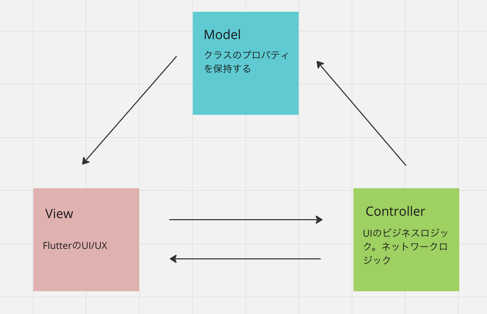

# FlutterでMVCパターンを考えてみた

## 🗺️MVCとは?
Model, View, Controllerの略です。

以前書いたiOSの記事ですが、こちらがわかりやすいと思いますが、FlutterでMVCについて解説している外国の人がいるのと、MVCパターンなパッケージを使っているGetXなるものあるので、ちょっと解説しながら説明しようと思います。

https://zenn.dev/joo_hashi/articles/7cfe0bd9192084

今回はこの動画を見てみて、モバイルだとSwiftと同じような設計で良いのかなと、
思いつつ、FlutterでMVCって感じのものを考えました。

https://www.youtube.com/watch?v=hekEUwofpa0

私の考えたものは、動画の外人さんと同じものだから、おそらくSwiftのStoryboardと
同じMVCかなと思ってます。



### 💾Model
これは、メンバー変数の値を保持してるもの。クラスの変数とかクラスのプロパティと
表現した方がいいかも。データベースのMySQLだとか、ローカルDBのRealmに合わせて
変数のデータ型を設計します。今回はFlutterのパッケージである`Isar`というNoSQLのローカルDBを使用しました。

https://isar.dev/ja/

これがFlutterのコード:
```dart
import 'package:isar/isar.dart';// 1. isarパッケージをインポート
part 'task.g.dart';// ファイル名.g.dartと書く

@collection
class Task {
  Id id = Isar.autoIncrement; // id = nullでも自動インクリメントされます。

  String? name;
  DateTime? createdAt;
}
```

Swiftだとこんな感じ:

ローカルDBの`Realm`を使ったモデルクラスです。カウンターアプリを作るときに、作ったものです。自動連番のIDとInt型のプロパティが定義されてます。

```swift
import Foundation
import RealmSwift

// カウンターのモデルを定義する
class Counter: Object, ObjectKeyIdentifiable {
    @Persisted(primaryKey: true) var id: ObjectId
    @Persisted var count: Int = 0
}
```

Ruby on Railsだとこんな感じ:

長いことやってないですが...

ORMの`Active Record`でDBを操作します。Webの技術だと、
ORMってのを使って、Model作って、DBを操作するんですよね。
```rb
class Post < ApplicationRecord
  validates :title, presence: true
  validates :content, presence: true
end
```

### 📺Viewとは?
ユーザーが操作する画面ですね。UIとか画面とか、Viewって人によって表現は違います。
Viewは、入力フォームからDBを操作したりAPIのデータを表示する役割があります。

StoryBoardだと、画像になるので今回省きます🙇

Flutterだとこんな感じ:
今回は、`flutter_hooks`でDBからデータを取ってくる処理を
してるので、削除の処理でコントローラーを使って、DBを操作して、ViewとDBの橋渡しをしてもらってるイメージですね。

`StatefulWidget`だと、Stateクラスがコントローラーの役割を持ってるらしいので、View側に書いた処理にもコントローラーがあっても間違いではなさそう?

Viewから操作 -> コントローラーを経由して通知🔔 -> DBを操作
```dart
import 'package:flutter/material.dart';
import 'package:flutter_hooks/flutter_hooks.dart';
import 'package:hooks_riverpod/hooks_riverpod.dart';
import 'package:isar/isar.dart';
import 'package:mvc_architecture/controller/task_controller.dart';
import 'package:mvc_architecture/model/task.dart';
import 'package:mvc_architecture/provider/isar.dart';

class ReadTaskPage extends HookConsumerWidget {
  const ReadTaskPage({super.key});


  @override
  Widget build(BuildContext context, WidgetRef ref) {
    // List<Person> persons = [];をuseStateで書き換えます
    final tasks = useState<List<Task>>([]);

    // データベースの中身を取得する関数
    Future<void> loadData() async {
      final data = await ref.read(isarProvider).tasks.where().findAll();
      tasks.value = data;
    }
    // 画面が表示された時にデータを取得する
    useEffect(() {
      loadData();
      return null;
    }, []);

    return Scaffold(
      appBar: AppBar(title: const Text('データを表示')),
      body: ListView.builder(
        itemCount: tasks.value.length,
        itemBuilder: (context, index) {
          final task = tasks.value[index];
          return ListTile(
              title: Text(task.name ?? "値が入ってません"),
              trailing: IconButton(
                icon: const Icon(Icons.delete),
                onPressed: () async {
                  // ここでデータベースから削除しています
                  await ref.read(taskControllerProvider).deleteTask(task);
                  await loadData();
                },
              ));
        },
      ),
    );
  }
}
```

Railsだとこんな感じ:

今時は、View側のコードは、フロントエンドの`React.js`や`Vue.js`で作るので、テンプレートエンジンを使うことはあまりないです。この場合だと、`Rails`はモデルとコントローラーしか使わないAPIだけのアプリケーションとして、作りますね。

テンプレートエンジンだと見づらいな....

これは、PHPみたいにHTMLにPOSTできるロジックを書いてサーバー側にリクエストを送っています。
```rb
<%= form_with(model: @post, local: true) do |form| %>
  <% if @post.errors.any? %>
    <div id="error_explanation">
      <h2><%= pluralize(@post.errors.count, "error") %> prohibited this post from being saved:</h2>

      <ul>
      <% @post.errors.full_messages.each do |message| %>
        <li><%= message %></li>
      <% end %>
      </ul>
    </div>
  <% end %>

  <div class="field">
    <%= form.label :title %>
    <%= form.text_field :title %>
  </div>

  <div class="field">
    <%= form.label :content %>
    <%= form.text_area :content %>
  </div>

  <div class="actions">
    <%= form.submit %>
  </div>
<% end %>
```

### Controllerとは?
ユーザーが操作したのをモデルに通知するときに使うものですね。コントローラーは、ViewからDBのデータを追加したり、DBの内容が変わると、Viewを更新してくれる機能ですね。

ViewとModelの間にいるものだと理解してくれればいいかなと思います。もっとわかりやすく言うと、ロジックが書いてある。

このコードは私の好みで、ロジックを定義したインターフェースを継承して、`riverpod generator`使ってますが、なくても使えます。ロジックを実行するだけなので...

Flutterだとこんな感じ:
```dart
import 'package:hooks_riverpod/hooks_riverpod.dart';
import 'package:mvc_architecture/interface/task_interface.dart';
import 'package:mvc_architecture/model/task.dart';
import 'package:mvc_architecture/provider/isar.dart';
import 'package:riverpod_annotation/riverpod_annotation.dart';
part 'task_controller.g.dart';

@Riverpod(keepAlive: true)
TaskController taskController(TaskControllerRef ref) => TaskController(ref);

class TaskController implements TaskInterface {
  TaskController(this.ref);
  final Ref ref;

  @override
  Future<void> createTask(Task task) async {
    try {
      await ref.read(isarProvider).writeTxn(() async {
        await ref.read(isarProvider).tasks.put(task);
      });
    } on Exception catch (e) {
      throw Exception(e);
    }
  }

  @override
  Future<void> deleteTask(Task task) async {
    try {
        await ref.read(isarProvider).writeTxn(() async {
          await ref.read(isarProvider).tasks.delete(task.id);
        });
      } on Exception catch (e) {
        throw Exception(e);
      }
  }
}
```

Railsだとこんな感じ:

View側からリクエストが来たら、コントローラのロジックを実行して、DBにこのコードだと追加する処理をしている。
```rb
class PostsController < ApplicationController
  def create
    @post = Post.new(post_params)

    if @post.save
      redirect_to @post, notice: 'Post was successfully created.'
    else
      render :new
    end
  end

  private

  def post_params
    params.require(:post).permit(:title, :content)
  end
end
```

### GetXだとこんな感じ!
https://github.com/jonataslaw/getx

コマンドを打つとファイルが自動生成されるのが、`Angular`や`Rails`に似ていてMVCだなと思いました。

コントローラーも一応ある:
```dart
class Controller extends GetxController{
  var count = 0.obs;
  increment() => count++;
}
```

状態管理から、短いコードで画面遷移、多言語対応ができるので、海外では流行っているとか?
東南アジアでは人気だそうです。

### まとめ
今回は、昔からある技術を比較しながら`MVC`について解説しました。今回は、`riverpod`を使っているので、ディレクトリの構成はこんな感じになってます。


ディレクトリ構成:
```
lib
├── controller
│   ├── task_controller.dart
│   └── task_controller.g.dart
├── core
│   └── logger.dart
├── interface
│   └── task_interface.dart
├── main.dart
├── model
│   ├── task.dart
│   └── task.g.dart
├── provider
│   ├── isar.dart
│   └── isar.g.dart
└── view
    ├── create_task_page.dart
    └── read_task_page.dart
```

簡単なサンプルを作るなら、`controller`、
`model`、`view`の３つだけで良いです。

`core`は、loggerやconverterを配置する場所だとか?
```dart
import 'package:logger/logger.dart';

final logger = Logger(
  printer: PrettyPrinter(
      methodCount: 2,
      errorMethodCount: 8,
      lineLength: 120,
      colors: true,
      printEmojis: true,
      printTime: false
  ),
);
```

`provider`には、Isarをグローバルに呼び出せるプロバイダーを定義してます。各ファイルで、`ref.read`で呼ぶことができます。
```dart
import 'package:isar/isar.dart';
import 'package:riverpod_annotation/riverpod_annotation.dart';
part 'isar.g.dart';

@riverpod
Isar isar(IsarRef ref) {
  throw UnimplementedError();
}
```

`interface`は`abstract`と同じように、ロジックを書いてないメソッドを定義したクラスですね。Dart3のはロジック書かないとエラー出ますが、abstract interface classにすると、abstractクラスと同じように使えるので、エラーなくなる?
これを定義する意味って、メソッドは２個しか作ったらダメだよとか、ルールを決めるためなんでしょうね。

参考になった動画:

https://www.youtube.com/watch?v=W30BhCS4Ook

```dart
import 'package:mvc_architecture/model/task.dart';

abstract interface class TaskInterface {
  Future<void> createTask(Task task);
  Future<void> deleteTask(Task task);
}
```

ここまで、MVCについて解説してみました。こちらに今回`Isar`で作ったDEMOアプリのソースコードを公開しております。

https://github.com/sakurakotubaki/MVC_Isar
